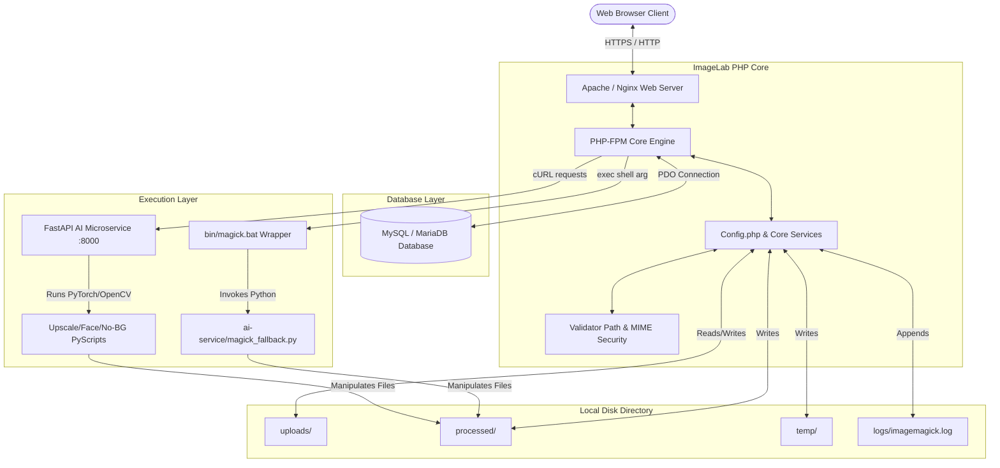
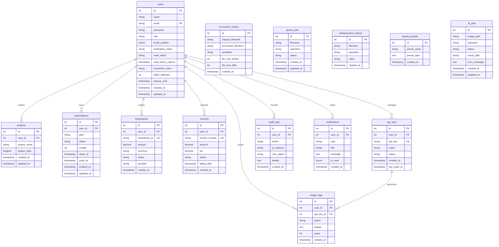
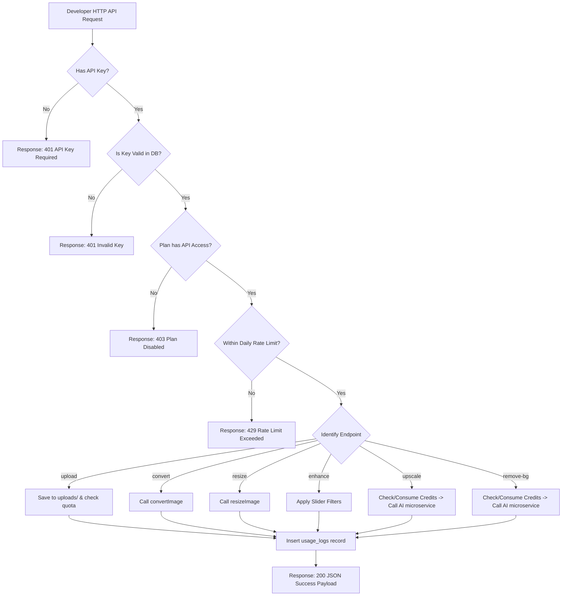

# ImageLab Comprehensive Platform Documentation

Welcome to the **ImageLab** platform documentation. This unified guide contains the System Architecture, Installation & Deployment Procedures, REST API Specifications, User Guide, and Administrative System Guide.

---

## 🗺️ 1. Architecture Diagrams

### 1.1 System Architecture Diagram
This diagram shows how web clients interact with the ImageLab web application (Apache/PHP), local file storage, the MySQL/MariaDB database, shell wrappers (ImageMagick/Pillow fallbacks), and the background FastAPI Python microservice.



### 1.2 Entity-Relationship (ER) Diagram
This diagram maps out the database tables, fields, types, and foreign key relationships that drive the SaaS Billing, User roles, API gateway rate limits, and async jobs.



### 1.3 API Gateway Lifecycle Diagram
This flowchart outlines the authorization checks, rates checking, routing, execution, and consumption logging performed inside the developer gateway.



---

## 🛠️ 2. Installation Guide

This guide details instructions for setting up the **ImageLab** platform on both local development machines and production Linux environments.

### 2.1 System Prerequisites
Before you start, make sure you have the following installed:
* **PHP**: version `8.1` or higher. Ensure these PHP modules are enabled in `php.ini`:
  * `pdo_mysql`, `gd`, `fileinfo`, `mbstring`, `openssl`, `curl`, `zip`, `xml`
* **Database**: MySQL `8.0` or MariaDB `10.5`
* **Web Server**: Apache Server (with `mod_rewrite` enabled to support `.htaccess` rewrite rules) or Nginx
* **Python**: version `3.9` or higher (necessary if deploying AI/FastAPI services)

### 2.2 Local Development Setup (Windows - Laragon / XAMPP)
1. **Clone/Move Codebase**:
   * Move the project folder inside your local server web root:
     * Laragon: `C:\laragon\www\ImageLab`
     * XAMPP: `C:\xampp\htdocs\ImageLab`
2. **Setup MySQL Database**:
   * Launch Laragon/XAMPP and turn on Apache and MySQL.
   * Access phpMyAdmin or connect using terminal and execute:
     ```sql
     CREATE DATABASE imagelab CHARACTER SET utf8mb4 COLLATE utf8mb4_unicode_ci;
     ```
   * Import the database structure from the repository:
     ```bash
     mysql -u root -p imagelab < imagelab_sql.sql
     ```
3. **Database Credentials**:
   * Open [core/Config.php](file:///c:/xampp/htdocs/ImageLab/core/Config.php) and verify database settings:
     ```php
     public const DB_HOST = 'localhost';
     public const DB_NAME = 'imagelab';
     public const DB_USER = 'root';
     public const DB_PASS = '';
     ```
4. **Access UI**:
   * Open the browser and visit: `http://localhost/ImageLab/public/`

### 2.3 Production Server Setup (Ubuntu Linux Server)
Follow these terminal instructions to build the server stack on Ubuntu:

#### 1. System Packages Installation
```bash
sudo apt update && sudo apt upgrade -y
# Install Nginx, MySQL, PHP 8.2-FPM & extensions, python venv
sudo apt install -y nginx mysql-server php8.2-fpm php8.2-mysql php8.2-gd php8.2-curl php8.2-mbstring php8.2-xml php8.2-zip python3 python3-pip python3-venv curl git
```

#### 2. Configure Database Security
```bash
sudo mysql_secure_installation
# Connect to create user and database
sudo mysql -u root -p
```
Inside MySQL console run:
```sql
CREATE DATABASE imagelab CHARACTER SET utf8mb4 COLLATE utf8mb4_unicode_ci;
CREATE USER 'imagelab_prod'@'localhost' IDENTIFIED BY 'HighEntropySecurePassword987!';
GRANT ALL PRIVILEGES ON imagelab.* TO 'imagelab_prod'@'localhost';
FLUSH PRIVILEGES;
EXIT;
```
Import the schema:
```bash
mysql -u imagelab_prod -p imagelab < /var/www/imagelab/imagelab_sql.sql
```

#### 3. Setup Virtual Environment for Python AI microservices
If deploying the background FastAPI AI microservice:
```bash
cd /var/www/imagelab/ai-service
python3 -v venv venv
source venv/bin/activate
pip install -r requirements.txt
```

#### 4. Configure Web Server (Nginx)
Create the configuration file: `/etc/nginx/sites-available/imagelab`
```nginx
server {
    listen 80;
    server_name yourdomain.com;
    root /var/www/imagelab/public;
    index index.php index.html;

    client_max_body_size 100M;

    location / {
        try_files $uri $uri/ /index.php?$query_string;
    }

    location ~ \.php$ {
        include snippets/fastcgi-php.conf;
        fastcgi_pass unix:/var/run/php/php8.2-fpm.sock;
        fastcgi_param SCRIPT_FILENAME $document_root$fastcgi_script_name;
        include fastcgi_params;
    }

    location ~ /\.(ht|git) {
        deny all;
    }
}
```
Enable server block and reload:
```bash
sudo ln -s /etc/nginx/sites-available/imagelab /etc/nginx/sites-enabled/
sudo nginx -t
sudo systemctl reload nginx
```

#### 5. Assign Write Permissions
Permissions must allow the web server (`www-data`) to write uploads and processed files:
```bash
sudo chown -R www-data:www-data /var/www/imagelab
sudo chmod -R 775 /var/www/imagelab/uploads
sudo chmod -R 775 /var/www/imagelab/processed
sudo chmod -R 775 /var/www/imagelab/logs
sudo chmod -R 775 /var/www/imagelab/temp
```

### 2.4 Background Worker & Queue Configuration
Background workers compile queue actions. 

#### Setup Systemd Daemon Worker
To ensure queue runs continuously in the background, create a systemd configuration file at `/etc/systemd/system/imagelab-worker.service`:
```ini
[Unit]
Description=ImageLab Background Jobs Queue Worker
After=mysql.service

[Service]
Type=simple
User=www-data
ExecStart=/usr/bin/php /var/www/imagelab/bin/queue_worker.php
Restart=always
RestartSec=5

[Install]
WantedBy=multi-user.target
```
Enable and start the service:
```bash
sudo systemctl daemon-reload
sudo systemctl enable imagelab-worker
sudo systemctl start imagelab-worker
```

---

## 🔌 3. API Documentation

The developer API gateway allows external systems to securely upload and process images.

### 3.1 Authentication
Authenticate requests by providing your API key (`il_...`) in the request header or as a query parameter.
* **Header (Recommended)**: `X-API-Key: il_your_api_key_here`
* **Query Parameter**: `?api_key=il_your_api_key_here`

### 3.2 Gateway Base URL
```text
POST http://yourdomain.com/api/v1/api_gateway.php?endpoint={action}
```

---

### 3.3 Endpoints Reference

#### 1. Image Upload
* **Endpoint**: `/api_gateway.php?endpoint=upload`
* **Method**: `POST`
* **Body Type**: `multipart/form-data`
* **Parameters**:
  * `image` (File, Required): The image file payload (max 10MB).
* **Sample Response**:
```json
{
    "success": true,
    "status": "success",
    "message": "Image uploaded successfully!",
    "data": {
        "filename": "7f6d84496226e562e876476a623595f1.png",
        "original_name": "photo.png",
        "size": 29236,
        "width": 150,
        "height": 99,
        "extension": "png"
    }
}
```

#### 2. Convert Image Format
* **Endpoint**: `/api_gateway.php?endpoint=convert`
* **Method**: `POST`
* **Body Type**: `application/x-www-form-urlencoded`
* **Parameters**:
  * `filename` (String, Required): The unique filename returned from upload.
  * `format` (String, Required): The target format (`jpg`, `png`, `webp`, `gif`, `bmp`, `tiff`).
* **Sample Response**:
```json
{
    "success": true,
    "status": "success",
    "message": "Conversion complete.",
    "data": {
        "filename": "7f6d84496226e562e876476a623595f1.webp",
        "original_format": "png",
        "converted_format": "webp",
        "size": 19430,
        "width": 150,
        "height": 99
    }
}
```

#### 3. Resize Image
* **Endpoint**: `/api_gateway.php?endpoint=resize`
* **Method**: `POST`
* **Body Type**: `application/x-www-form-urlencoded`
* **Parameters**:
  * `filename` (String, Required): The unique filename.
  * `width` (Int, Optional): Target width in pixels (0 for auto).
  * `height` (Int, Optional): Target height in pixels (0 for auto).
  * `maintainRatio` (Int, Optional): `1` to preserve ratio (default), `0` to stretch.
* **Sample Response**:
```json
{
    "success": true,
    "status": "success",
    "message": "Resize complete.",
    "data": {
        "filename": "7f6d84496226e562e876476a623595f1_resized.png",
        "size": 12894,
        "width": 100,
        "height": 66
    }
}
```

#### 4. Apply Enhancement Filters
* **Endpoint**: `/api_gateway.php?endpoint=enhance`
* **Method**: `POST`
* **Body Type**: `application/x-www-form-urlencoded`
* **Parameters**:
  * `filename` (String, Required): The unique filename.
  * `brightness` (Int, Optional): Exposure adjustment value (`-100` to `100`).
  * `contrast` (Int, Optional): Contrast adjustment value (`-100` to `100`).
  * `saturation` (Int, Optional): Saturation adjustment value (`-100` to `100`).
* **Sample Response**:
```json
{
    "success": true,
    "status": "success",
    "message": "Enhancement applied.",
    "data": {
        "filename": "7f6d84496226e562e876476a623595f1_api_enhance.png",
        "size": 28450
    }
}
```

#### 5. AI Super-Resolution (Upscale)
* **Endpoint**: `/api_gateway.php?endpoint=upscale`
* **Method**: `POST`
* **Body Type**: `application/x-www-form-urlencoded`
* **Parameters**:
  * `filename` (String, Required): The unique filename.
* **Sample Response**:
```json
{
    "success": true,
    "status": "success",
    "message": "AI Upscaling complete.",
    "data": {
        "filename": "7f6d84496226e562e876476a623595f1_api_upscale.png",
        "size": 184590
    }
}
```

#### 6. AI Background Removal
* **Endpoint**: `/api_gateway.php?endpoint=remove-background`
* **Method**: `POST`
* **Body Type**: `application/x-www-form-urlencoded`
* **Parameters**:
  * `filename` (String, Required): The unique filename.
* **Sample Response**:
```json
{
    "success": true,
    "status": "success",
    "message": "AI Background Removal complete.",
    "data": {
        "filename": "7f6d84496226e562e876476a623595f1_api_nobg.png",
        "size": 94820
    }
}
```

---

## 📖 4. User Guide

### 4.1 Registrations & Plan Tiers
1. **Create Account**: Visit the registration page. Upon signing up, you receive the **Free Plan** by default (which allocates 5 daily AI credits, 50MB space).
2. **Upgrade Plans**:
   * Visit the billing/subscriptions panel.
   * Select a plan tier:
     * **Starter** ($10.99/mo): 100 AI credits, 500MB cloud space, API key generation access.
     * **Professional** ($29.99/mo): 500 AI credits, 5GB cloud space, API access.
     * **Enterprise** ($99.99/mo): Unlimited operations, 50GB cloud space, API access.
   * Sandbox payment simulations can be run directly using the PayPal mock layout.

### 4.2 Workspace Navigation
* **Convert Tab**: Convert files to WebP, JPEG, PNG, or GIF. The converted image is displayed next to the original inside the comparison view.
* **Resize Tab**: Resize images using custom dimensions or platform presets (Instagram Post, YouTube Thumbnail, etc.).
* **Advanced Resizer**: You can chain resizes together. Once resized, you can immediately resize the output image *again* (on top of the current dimensions) by inputting new numbers and hitting **Apply**.
* **Compress Tab**: Optimize images by selecting preset options (Low, Medium, High, Max) to compress file sizes with minimal quality degradation.
* **Canvas Tab**: Interactive editor powered by Fabric.js.
  * **Smart Crop**: Click "Crop Mode" to display a crop outline frame. Click and drag the white corner handles to highlight crop areas, and click "Execute Crop".
  * **Text Watermarks**: Input custom text, adjust size, transparency, and click "Add Text" to layer watermarks.
* **AI Editor Tab**:
  * **Auto-Enhance**: Analyzes the image and corrects color temperature casts, exposure levels, and white balance settings automatically.
  * **Super Resolution**: Upscales images (2x or 4x) using AI models while maintaining details.
  * **Remove Background**: Isolates subjects and removes backgrounds to output transparent PNGs.

---

## 👑 5. Admin Guide

Administrative users can manage system assets, promote users, review analytics charts, and monitor background tasks.

### 5.1 Admin Control Panel
Access the Admin control panel by logging in as an administrator (standard seed: `admin@imagelab.com` / password `admin`).
The admin landing page provides aggregate metrics:
* **User Accounts**: Manage user profiles, active keys, billing history, or delete users.
* **Revenue Logs**: Track monthly subscriptions transaction logs.
* **Storage Metrics**: Total size of cloud files on disk across `uploads/` and `processed/` folders.

### 5.2 User Management & Role Promotion
* Search for any user by name or email.
* Modify roles directly (e.g. promote a user to `premium` or `admin`).
* Edit credits balances to grant manual AI operational requests.
* Clear lockouts if standard users block their profiles (occurring automatically after 5 consecutive incorrect passwords).

### 5.3 SaaS Usage Charts
Review service operations and metrics using the dynamic Chart.js dashboards:
* **Active Logins**: Tracks authentications over a rolling 7-day period.
* **Revenue growth**: Line charts monitoring subscription billing.
* **Feature Share**: Pie charts comparing the usage share of Conversions, Resizes, Compression, and AI requests.

### 5.4 Queue Management & Stuck Job Diagnostics
Background jobs are queued inside the database `ai_jobs` and `queue_jobs` tables.
If execution errors occur (e.g. `Queue Job #10 failed` or `Python execution failed`):
1. **Inspect Log Files**:
   * API Gateway and Python connection failures are logged under [logs/ai_error.log](file:///c:/xampp/htdocs/ImageLab/logs/ai_error.log).
   * ImageMagick shell errors are logged under [logs/imagemagick.log](file:///c:/xampp/htdocs/ImageLab/logs/imagemagick.log).
2. **Review DB State**:
   * Open the database management panel or use the admin queue section to review the specific job record (which contains the full Python traceback message under `error_message`).
3. **Queue Controls (UI)**:
   * **Cancel Queue**: Terminates all currently queued or processing async jobs.
   * **Clear History**: Wipes the queue database table logs to keep database storage lightweight.
