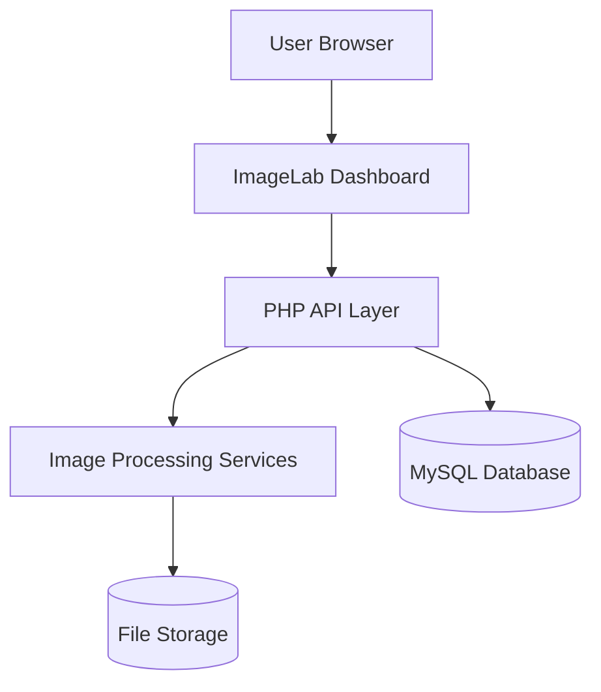
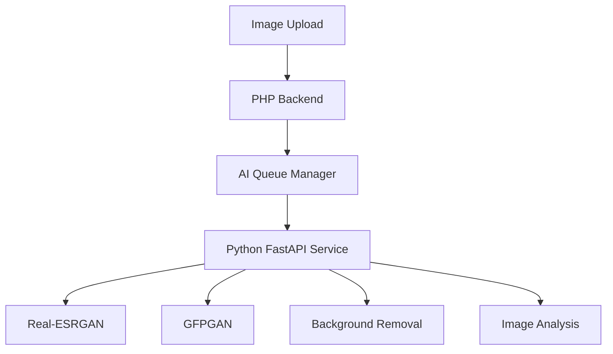

# 🖼️ ImageLab AI-Powered Image Processing, Enhancement, and Optimization Platform

[](https://www.php.net/)
[](https://www.mysql.com/)
[](https://getbootstrap.com/)
[](https://imagemagick.org/)
[](https://fastapi.tiangolo.com/)

> A professional image processing and optimization platform that combines image conversion, compression, resizing, enhancement, interactive editing, and AI-powered image restoration into a unified workflow.

---

## 📋 Table of Contents

* Overview
* System Architecture
* Key Features
* Technical Highlights
* AI Capabilities
* Tech Stack
* Project Structure
* Database Schema
* Getting Started
* Installation
* Database Setup
* Usage
* Security Features
* Roadmap
* License

---

## 📌 Overview

ImageLab is a modern image processing platform designed for content creators, developers, marketers, photographers, designers, and businesses.

Unlike traditional image converters that only support basic format conversion, ImageLab provides a complete image workflow solution that includes:

* Image conversion
* Image compression
* Interactive resizing
* Batch processing
* Image enhancement
* Metadata management
* Watermarking
* AI upscaling
* AI face restoration
* AI background removal

The platform combines traditional image processing powered by ImageMagick with modern AI services powered by FastAPI and Python.

---

## 🏗️ System Architecture

### Core Processing Workflow



### AI Processing Workflow



---

## ✨ Key Features

### 🖼️ Image Conversion Suite

* JPG to PNG
* PNG to WEBP
* WEBP to JPG
* Multi-format support
* Batch conversion
* Drag-and-drop uploads
* Conversion history tracking

### 📏 Smart Resize Engine

* Custom dimensions
* Aspect ratio locking
* Preset social media sizes
* Website optimization presets
* Interactive resize controls
* Real-time preview

### 📦 Image Compression

* Lossless compression
* Adjustable quality settings
* Storage savings analytics
* Web optimization presets
* Batch compression support

### 🎨 Interactive Image Editor

* Crop tool
* Rotate tool
* Flip tool
* Zoom controls
* Canvas editor
* Undo and redo system
* Workspace saving

### 🚀 Enhancement Studio

* Brightness adjustment
* Contrast adjustment
* Saturation control
* Sharpness control
* Auto-enhance mode
* Preset enhancement profiles

### 🔖 Metadata & Privacy Tools

* EXIF metadata viewer
* Metadata removal
* Privacy protection tools
* Export sanitization

### 💧 Watermark System

* Text watermarks
* Logo watermarks
* Opacity controls
* Position controls
* Batch watermarking

---

## 🤖 AI Capabilities

### AI Image Upscaling

Powered by Real-ESRGAN

Features:

* 2x Upscaling
* 4x Upscaling
* Detail recovery
* Noise reduction
* Texture enhancement

### AI Face Restoration

Powered by GFPGAN

Features:

* Face detection
* Face enhancement
* Portrait restoration
* Blur reduction

### AI Background Removal

Features:

* Transparent PNG export
* Subject isolation
* Edge refinement
* Product image optimization

### AI Quality Analysis

Automatically analyzes:

* Sharpness
* Resolution
* Exposure
* Noise level
* Image quality score

### AI Smart Recommendations

Suggests:

* Best export format
* Compression settings
* Enhancement profiles
* Upscaling requirements

---

## 🛠 Technical Highlights

### 1. Interactive Editing Engine

Built using Fabric.js for real-time image manipulation.

Features:

* Live transformations
* Non-destructive editing
* Workspace management
* Instant visual feedback

### 2. Processing Queue System

Advanced queue architecture for handling:

* Batch processing
* AI operations
* Export jobs
* Background tasks

### 3. Modular Service Architecture

Separation of concerns through:

* ImageService
* EnhancementService
* QueueManager
* AIService
* ExportManager

### 4. SaaS Ready Foundation

Supports:

* User accounts
* Subscription plans
* API keys
* Usage tracking
* Billing integration

---

## 🛠 Tech Stack

### Backend

* PHP 8.2+
* MySQL 8+
* ImageMagick
* Composer

### Frontend

* HTML5
* CSS3
* Bootstrap 5
* JavaScript ES6
* Fabric.js

### AI Services

* Python 3.10+
* FastAPI
* OpenCV
* PyTorch
* Real-ESRGAN
* GFPGAN

### Development Environment

* Laragon
* Git
* GitHub

---

## 📁 Project Structure

```text
imagelab/
├── public/
├── uploads/
├── processed/
├── temp/
├── assets/
│   ├── css/
│   ├── js/
│   └── images/
├── api/
│   ├── upload.php
│   ├── convert.php
│   ├── resize.php
│   ├── enhance.php
│   ├── download.php
│   └── ai/
├── core/
│   ├── ImageService.php
│   ├── FileManager.php
│   ├── QueueManager.php
│   ├── EnhancementService.php
│   ├── AIService.php
│   └── ExportManager.php
├── ai-service/
│   ├── main.py
│   ├── upscale.py
│   ├── face_enhance.py
│   └── background_remove.py
├── database/
└── README.md
```

---

## 🗄 Database Schema

| Table               | Description                      |
| ------------------- | -------------------------------- |
| users               | User accounts and authentication |
| projects            | Saved image projects             |
| conversion_history  | Conversion records               |
| enhancement_history | Enhancement logs                 |
| queue_jobs          | Processing queue                 |
| ai_jobs             | AI task queue                    |
| subscriptions       | Subscription plans               |
| api_keys            | Developer API access             |
| usage_logs          | System usage analytics           |
| audit_logs          | Security and activity tracking   |

---

## 🚀 Getting Started

### Prerequisites

* Laragon
* PHP 8.2+
* MySQL 8+
* Composer
* ImageMagick
* Python 3.10+ (for AI features)

### Installation

```bash
git clone https://github.com/yourusername/imagelab.git
```

Move project into:

```bash
C:\laragon\www\imagelab
```

Start:

* Apache
* MySQL

Access:

```bash
http://localhost/imagelab
```

---

## 🔒 Security Features

* Prepared Statements
* CSRF Protection
* XSS Protection
* MIME Validation
* Secure File Uploads
* Directory Access Restrictions
* Rate Limiting
* Queue Abuse Prevention
* Secure Session Management
* API Key Authentication

---

## 🗺️ Development Roadmap

### Phase 1

* Upload System
* Conversion Engine

### Phase 2

* Resize
* Compression
* Batch Processing

### Phase 3

* Interactive Editor
* Live Canvas Editing

### Phase 4

* Enhancement Tools
* Watermarking
* Metadata Tools

### Phase 5

* AI Upscaling
* Face Restoration
* Background Removal

### Phase 6

* SaaS Platform
* Billing
* Analytics
* Public API

---

## 📄 License

This repository is built for educational, portfolio, and research purposes.

All rights reserved.

<div align="center">
  <sub>ImageLab © 2026</sub>
</div>
