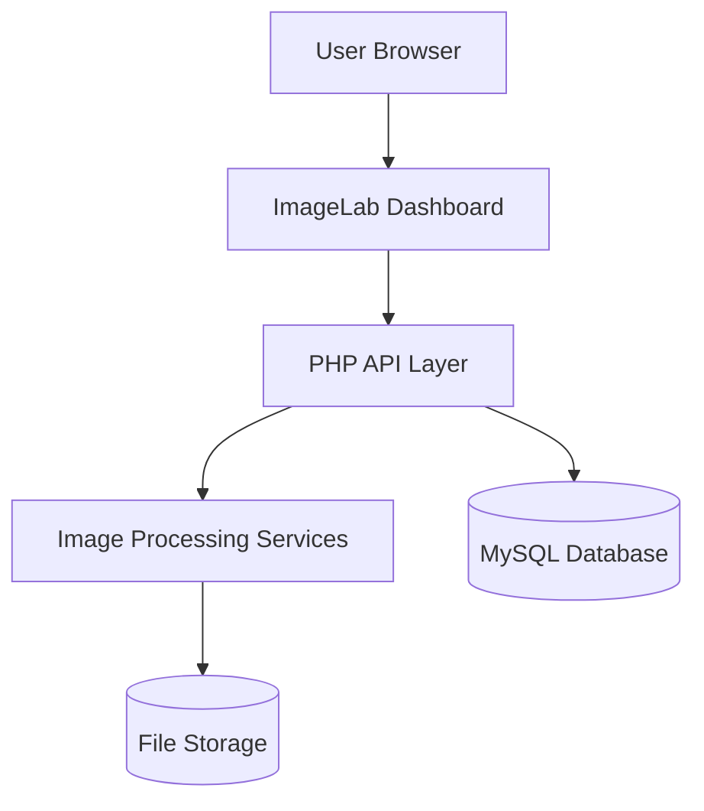
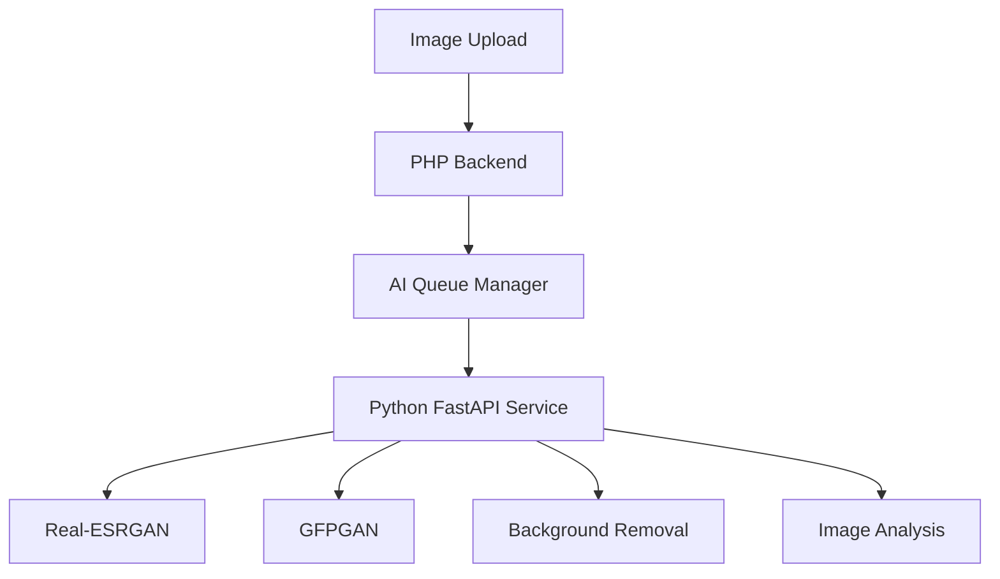

# 🖼️ ImageLab: AI-Powered Image Processing, Editing, and Optimization Suite

[](https://www.php.net/)
[](https://www.mysql.com/)
[](https://getbootstrap.com/)
[](https://imagemagick.org/)
[](https://fastapi.tiangolo.com/)

> A professional image processing and optimization platform that combines image conversion, compression, resizing, enhancement, interactive editing, and AI-powered image restoration into a unified workflow.

---

## 📋 Table of Contents

* Overview
* System Architecture
* Key Features
* Technical Highlights
* AI Capabilities
* Tech Stack
* Project Structure
* Database Schema
* Getting Started
* Usage
* Security Features
* Development Roadmap
* License

---

## 📌 Overview

ImageLab is a modern image processing platform designed for content creators, photographers, designers, marketers, developers, students, and businesses.

Unlike traditional image converters that only focus on file conversion, ImageLab provides a complete image workflow solution in a single platform.

Core capabilities include:

* Image conversion
* Image compression
* Smart resizing
* Interactive editing
* Batch processing
* Metadata management
* Watermarking
* Export optimization
* AI image enhancement
* AI face restoration
* AI background removal

The platform combines traditional image processing powered by ImageMagick with modern AI services powered by FastAPI and Python.

---

## 🏗️ System Architecture

### Core Processing Workflow



### AI Processing Workflow



---

## ✨ Key Features

### 🖼️ Image Conversion

* JPG to PNG
* PNG to WEBP
* WEBP to JPG
* PNG to JPG
* Multi-format support
* Conversion history
* Fast processing engine

### 📏 Smart Resizing

* Custom dimensions
* Aspect ratio lock
* Preset social media dimensions
* Website optimization presets
* Interactive resizing controls
* Real-time preview

### 📦 Compression Engine

* Adjustable compression levels
* Storage savings analytics
* Web optimization profiles
* Batch compression
* Quality preservation

### 🎨 Interactive Editor

* Crop tool
* Rotate tool
* Flip tool
* Zoom controls
* Canvas editor
* Undo and redo system
* Workspace saving

### 🚀 Enhancement Studio

* Brightness adjustment
* Contrast adjustment
* Saturation control
* Sharpness control
* Auto enhancement
* Custom enhancement presets

### 💧 Watermarking System

* Text watermarks
* Logo watermarks
* Opacity control
* Position presets
* Batch watermarking

### 🔖 Metadata Tools

* EXIF metadata viewer
* Metadata removal
* Privacy protection tools
* Export sanitization

### ⚡ Batch Processing

* Multiple file uploads
* Queue management
* Bulk conversion
* Bulk compression
* Bulk resizing

---

## 🤖 AI Capabilities

### AI Image Upscaling

Powered by Real-ESRGAN

Features:

* 2x Upscaling
* 4x Upscaling
* Detail recovery
* Texture enhancement
* Noise reduction

### AI Face Restoration

Powered by GFPGAN

Features:

* Face detection
* Portrait enhancement
* Blur reduction
* Facial detail restoration

### AI Background Removal

Features:

* Transparent PNG export
* Subject extraction
* Product image optimization
* Edge refinement

### AI Quality Analysis

Automatically evaluates:

* Sharpness
* Exposure
* Resolution
* Noise levels
* Overall image quality

### AI Smart Recommendations

Provides recommendations for:

* Export settings
* Compression levels
* Enhancement presets
* Upscaling requirements

---

## 🛠 Technical Highlights

### 1. Interactive Editing Engine

Built using Fabric.js for browser-based image editing.

Features:

* Live transformations
* Real-time previews
* Non-destructive editing
* State management
* Workspace restoration

### 2. Processing Queue System

Advanced processing architecture for:

* Batch jobs
* AI operations
* Export processing
* Background tasks

### 3. Modular Service Architecture

Core services include:

* ImageService
* FileManager
* EnhancementService
* QueueManager
* AIService
* ExportManager

### 4. SaaS-Ready Foundation

Supports future expansion for:

* User accounts
* API access
* Subscription plans
* Usage analytics
* Billing systems

---

## 🛠 Tech Stack

### Backend

* PHP 8.2+
* MySQL 8+
* ImageMagick
* Composer

### Frontend

* HTML5
* CSS3
* Bootstrap 5
* JavaScript ES6
* Fabric.js

### AI Services

* Python 3.10+
* FastAPI
* OpenCV
* PyTorch
* Real-ESRGAN
* GFPGAN

### Development Environment

* XAMPP
* Git
* GitHub

---

## 📁 Project Structure

```text
imagelab/
├── public/
├── uploads/
├── processed/
├── temp/
├── assets/
│   ├── css/
│   ├── js/
│   └── images/
├── api/
│   ├── upload.php
│   ├── convert.php
│   ├── resize.php
│   ├── compress.php
│   ├── enhance.php
│   ├── download.php
│   └── ai/
├── core/
│   ├── ImageService.php
│   ├── FileManager.php
│   ├── EnhancementService.php
│   ├── QueueManager.php
│   ├── AIService.php
│   └── ExportManager.php
├── ai-service/
│   ├── main.py
│   ├── upscale.py
│   ├── face_enhance.py
│   ├── background_remove.py
│   └── quality_score.py
├── database/
│   └── imagelab.sql
└── README.md
```

---

## 🗄️ Database Schema

| Table               | Description                      |
| ------------------- | -------------------------------- |
| users               | User authentication and profiles |
| projects            | Saved image editing projects     |
| conversion_history  | Conversion activity logs         |
| enhancement_history | Image enhancement records        |
| queue_jobs          | Background processing queue      |
| ai_jobs             | AI processing tasks              |
| subscriptions       | Subscription plans               |
| api_keys            | Developer API keys               |
| usage_logs          | User activity analytics          |
| audit_logs          | Security and activity tracking   |

---

## 🚀 Getting Started

### Prerequisites

* XAMPP 8.2+
* PHP 8.2+
* MySQL 8+
* Composer
* ImageMagick
* Python 3.10+ (for AI features)

### Installation

Clone the repository:

```bash
git clone https://github.com/yourusername/imagelab.git
```

Move the project into:

```text
C:\xampp\htdocs\imagelab
```

Start the following services in XAMPP:

* Apache
* MySQL

Open:

```text
http://localhost/imagelab
```

### Database Setup

1. Open phpMyAdmin:

```text
http://localhost/phpmyadmin
```

2. Create a database:

```sql
CREATE DATABASE imagelab;
```

3. Import:

```text
database/imagelab.sql
```

4. Configure database credentials:

```php
define('DB_HOST', 'localhost');
define('DB_NAME', 'imagelab');
define('DB_USER', 'root');
define('DB_PASS', '');
```

---

## 🖥️ Usage

### Main Application

```text
http://localhost/imagelab
```

### Admin Dashboard

```text
http://localhost/imagelab/admin
```

### API Documentation

```text
http://localhost/imagelab/api/docs
```

### AI Service Documentation

```text
http://127.0.0.1:8000/docs
```

---

## 🔒 Security Features

* Prepared Statements
* CSRF Protection
* XSS Protection
* Secure Session Management
* MIME Type Validation
* Upload Restrictions
* Directory Access Control
* API Key Authentication
* Queue Abuse Prevention
* Rate Limiting
* Audit Logging

---

## 🗺️ Development Roadmap

### Phase 1

* Upload System
* Conversion Engine
* Download System

### Phase 2

* Resize Engine
* Compression Engine
* Batch Processing
* Queue System

### Phase 3

* Interactive Editor
* Crop Tool
* Zoom Controls
* Workspace Saving

### Phase 4

* Enhancement Tools
* Watermarking
* Metadata Management
* Export System

### Phase 5

* AI Upscaling
* Face Restoration
* Background Removal
* Smart Recommendations

### Phase 6

* User Accounts
* Subscription Plans
* Public API
* Analytics Dashboard

---

## 📄 License

This repository is built for educational, portfolio, and research purposes.

All rights reserved.

<div align="center">
  <sub>ImageLab © 2026</sub>
</div>
